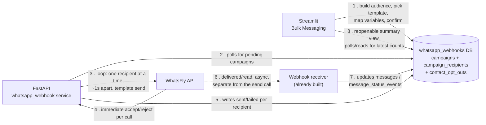

# Bulk Send — Build Plan

Working plan for the actual "send" step of Marketing → WhatsFly → Bulk Messaging
(the piece explicitly deferred in `CLAUDE.md`'s Bulk Messaging section: "filtered
audience × picked template → dispatch to WhatsFly"). Lives here, not in
`CLAUDE.md`, because nothing below is built yet — this is a plan, not a build
record. Once a phase ships, its outcome moves into `CLAUDE.md` the normal way,
and its checkbox here gets ticked.

Check off phases top-to-bottom as they're built and confirmed. Each phase is
meant to be independently useful/testable before the next one starts — no
phase depends on guessing ahead at a later one.

---

## Decisions locked in (from the Q&A)

| # | Question | Decision |
|---|---|---|
| 1 | Where does the loop run? | A **separate background process**, not inside a Streamlit script run — Streamlit stays fully responsive for every user while a campaign is in flight. |
| 2 | Pacing | ~0.8–1s between sends. Audiences are expected in the 10s–300s range (market-specific sends), never 1000s, so this is fine end-to-end (a 300-recipient campaign takes ~5 minutes). |
| 3 | Stop/pause mid-send | **No** — once confirmed, it runs to completion. A clear warning is shown before that confirmation, not after. |
| 4 | Progress feedback | A **final summary** once the loop finishes (sent/failed/delivered counts) — no live per-message progress bar needed. |
| 5 | Retry-on-failure | **No automatic retry.** Failures sit there; staff manually review and decide whether to resend. |
| 6 | Failure classification | **Yes** — distinguish permanent (bad number format, rejected) from transient failures. Permanent ones (bad formats/numbers) get saved to a reviewable list so staff can go verify/correct with the customer. |
| 7 | Crash mid-send | No resume-from-checkpoint logic — if it crashes partway, just **re-run the campaign**; the dedup guard (below) skips whoever already went out. |
| 8 | Persist a campaign concept? | **Yes, fully.** New tables in the **`whatsapp_webhooks` database** (the existing webhook-service DB, not the main app DB) — one holding per-customer send/delivery detail, one holding the campaign itself (id + filters used). |
| 9 | Exact schema for the campaign record | **Deferred on purpose** — "another discussion, in detail, when we get to it." Phase 1 below is that discussion. Nothing below assumes a final shape yet. |
| 10 | Per-recipient tracking | **Yes.** |
| 11 | Dedup guard | **Yes** — this is *why* campaign persistence matters: a (campaign, customer) pair that's already gone out doesn't go out again on a re-run. |
| 12 | Variable mapping per campaign | **Collaborative, per-template** — when a new template is made, you and I map its variables to customer attributes together at that time. Matches the existing `_WF_BULK_TEMPLATE_VIEWS` pattern already in the codebase (one handler per real campaign, not a generic system built in advance) — this is a *process* to follow each time, not a one-off build. |
| 13 | Header image | Same image for every recipient in a campaign — no per-recipient customization. |
| 14 | Templates only? | **Yes, confirmed.** Bulk send is template-path only — plain session-text replies to individual customers keep happening through the existing WhatsFly/WhatsApp manager panel, not through bulk. |
| 15 | Confirmation step before commit | **Yes, definitely.** |
| 16 | Opt-out / do-not-contact | **Yes** — a settable per-customer flag, stored in the new DB tables, managed manually by staff (not an automated "STOP"-keyword parser for v1). |
| 17 | Local testing | No elaborate local fake-endpoint harness — real testing happens after deploying, against real WhatsFly, to known/trusted numbers. **Plus**: a small "manual number list" test mode (an expander, typed-in numbers instead of the filtered audience) that runs through the *exact same* send mechanism, so pacing/throttling/mechanics can be proven out safely before a real campaign ever runs. |

---

## Two forks this raised — locked in for Phase 1 (say now if either should go the other way)

**A. How does Streamlit hand a campaign to the background process? → (a) Poll-based.**
Streamlit only ever *writes* to the new campaign tables (insert a `campaigns` row + its `campaign_recipients` rows, status `pending`). The FastAPI webhook service polls for `pending` campaigns on an interval and picks them up itself — no new networked endpoint, no auth scheme for it, no reachability assumption between wherever Streamlit runs and the webhook host. The only cost is a small delay (one poll interval, e.g. 5–10s) before a confirmed campaign actually starts — a non-issue given campaigns aren't stop-able anyway and there's no live progress UI to feel that lag in.

**B. Does Streamlit get write access to the `whatsapp_webhooks` DB? → Yes, via a second, narrow role.**
Today, per `CLAUDE.md`, Streamlit's existing role there is **SELECT-only** (`core/whatsapp_webhook_db.py`), never the webhook service's own write role — that stays completely unchanged. A **new, separate** role (`streamlit_campaign_writer`) gets `INSERT`/`UPDATE`/`SELECT` on only the three new tables (`campaigns`, `campaign_recipients`, `contact_opt_outs`) — still zero access to `messages`/`contacts`/`webhook_events`/etc. Built and verified below (`add_streamlit_campaign_role.sql`).

---

## Architecture



Streamlit never blocks on the send loop and never talks to WhatsFly directly for
a campaign — it only ever reads and writes rows in Postgres. The FastAPI service
(already always-on, already owns this database) does the actual sending. Delivery
status keeps arriving on its own schedule via the webhook path that already
exists, same as every other outbound message today.

---

## Build phases

### Phase 1 — Schema + handoff mechanism (the deferred "detailed discussion") ✅ schema done
- [x] Confirm forks A and B above (or adjust) — locked in as written above, pending final sign-off.
- [x] Finalize DDL for `campaigns`, `campaign_recipients`, and `contact_opt_outs`. Written as two files:
  - **`whatsapp_webhook/add_bulk_campaign_tables.sql`** — the one to actually run against the real, already-deployed `whatsapp_webhooks` database.
  - **`whatsapp_webhook/schema.sql`** — updated in place with the identical DDL, so a *fresh* setup (per its own header comment) includes these tables too.
  - Every `CREATE TABLE`, `CHECK`, and index verified against a throwaway local Postgres 14 database (loaded from `schema.sql` first to replicate the real starting state, then dropped) — not against the real database, which this environment has no connection to. Specifically exercised and confirmed: the `UNIQUE (campaign_id, cusid)` dedup guard rejects a duplicate insert; `status`/`failure_type` `CHECK` constraints reject bad values; the partial `UNIQUE` index on `wamid` allows any number of `NULL`s but rejects a real duplicate; `contact_opt_outs`' `UNIQUE (zid, cusid)` rejects a duplicate opt-out.
- [x] Dedup scope: **per-campaign-id only** (`UNIQUE (campaign_id, cusid)`) — re-running the *same* campaign is safe; a customer can still appear in a *different* future campaign. Matches "just rerun with dedup" from Q7 as the simplest correct reading.
  - **Bonus finding while designing this**: because `campaign_recipients` rows start `pending` and the send worker (Phase 3) will only ever process rows still `pending` for a campaign, "crash mid-send → just re-run" from Q7 needs **no separate resume/checkpoint logic at all** — a crash simply leaves some rows `sent`/`failed` and the rest `pending`, and re-running the same worker against the same `campaign_id` naturally picks up only what's left. One mechanism covers both the dedup guard and crash recovery.
- [x] Opt-out flag: its own table, `contact_opt_outs` (`zid`, `cusid`, `opted_out_at`, `opted_out_by`, `reason`, `UNIQUE (zid, cusid)`) — checked once at campaign-creation time (Phase 2), independent of which campaign.
- [x] New DB role written: **`whatsapp_webhook/add_streamlit_campaign_role.sql`** — creates `streamlit_campaign_writer` with `INSERT`/`UPDATE`/`SELECT` on exactly the three new tables (plus the sequence grants `BIGSERIAL` needs to actually allow inserts) and nothing else. Verified end-to-end against a scratch database: connecting *as* that role, inserting into `campaigns` and `campaign_recipients` both succeeded; inserting into the existing `messages` table correctly failed with `permission denied`.
- [x] **`campaigns.zid`/`campaign_recipients`/`contact_opt_outs` tables created for real** against the live `whatsapp_webhooks` database (done directly, outside this session) — `add_bulk_campaign_tables.sql`/`schema.sql` are now kept as from-scratch reference only; re-running either against the live DB will just error on "already exists," which is expected and fine.
- [x] **Per-template resend cooldown** — a real gap found after the fact: the `UNIQUE (campaign_id, cusid)` guard only stops the *same* campaign re-targeting someone, not a *different* campaign a week later. Explicit decision: **scoped per template**, not a blanket cross-campaign cooldown — a customer already sent template T1 in the last N days is excluded from a *new* T1 campaign, but a different template (T2) can still reach them sooner. Built as:
  - `whatsapp_webhook/add_campaign_cooldown_column.sql` — `ALTER TABLE campaigns ADD COLUMN cooldown_days INTEGER NOT NULL DEFAULT 30` — **this one is NOT yet run against the live database** (tables already existed without it before this column was designed) — needs to be run for real, same as the role script below.
  - Also added inline to both `add_bulk_campaign_tables.sql` and `schema.sql`'s `CREATE TABLE campaigns` for fresh-setup accuracy going forward.
  - Persisted **per campaign**, not a bare code constant — so a later "why wasn't customer X in this campaign" audit stays answerable even if the default value in code changes afterward.
  - The actual exclusion query (Phase 2's job, not schema) verified against realistic scratch data: customer sent template T1 10 days ago → correctly excluded from a new T1 campaign (30-day window); another customer sent T1 40 days ago → correctly included (outside window); the *first* customer's separate T2 send 5 days ago correctly did **not** block them from T1 — confirming the per-template scope holds. Query shape: `campaign_recipients` joined to `campaigns` on `template_id`, filtered to `status = 'sent'` (a failed attempt never reached them, so it shouldn't count) and `sent_at >= now() - interval 'N days'`.
- [x] Credential-loading side wired ahead of time: **`config/whatsapp_webhook_campaign_db.ini`** (gitignored, `.ini` is blanket-ignored) is the file — `config/settings.py::get_whatsapp_webhook_campaign_db_params()` reads it, mirroring `get_whatsapp_webhook_db_params()`'s exact shape (`host`/`port`/`dbname`/`user`/`password`, never raises). **Deliberately a separate file, not a second section in the existing `whatsapp_webhook_db.ini`** — keeps the two roles' credentials physically apart, matching the one-file-per-credential-set convention already used for `whatsfly.ini`/`direct_whatsapp.ini`/`whatsapp_webhook_db.ini`. There are three distinct DB roles in play now, only two of which ever belong in a Streamlit `config/*.ini`: `streamlit_reader` (existing, read-only, `whatsapp_webhook_db.ini`) and `streamlit_campaign_writer` (new, `whatsapp_webhook_campaign_db.ini`) — `webhook_svc` (the webhook FastAPI service's own full-write role) stays entirely in that separate service's own `.env` on the server and never touches a Streamlit config file at all.
- [ ] Still open: **running** `add_campaign_cooldown_column.sql` and `add_streamlit_campaign_role.sql` against the real database (the table-creation script itself is already done), then filling in the real generated password into `config/whatsapp_webhook_campaign_db.ini`:
  ```ini
  [whatsapp_webhook_campaign_db]
  host = <same host as whatsapp_webhook_db.ini>
  port = 5432
  dbname = whatsapp_webhooks
  user = streamlit_campaign_writer
  password = <the real password put into add_streamlit_campaign_role.sql before running it>
  ```
  Not done from here — no connection to that database in this environment.

### Phase 2 — Campaign creation in Streamlit (no sending yet)
- [ ] "Send" step at the bottom of Bulk Messaging: pick/confirm template + variable mapping (see Phase 6 for the mapping *process* — this phase just wires up whatever mapping already exists), show the confirmation warning (Q3/Q15), and on confirm, insert one `campaigns` row (with `cooldown_days`, defaulting to 30 but adjustable) + one `campaign_recipients` row per final-list customer (status `pending`).
- [ ] Two exclusions applied before those rows are inserted, each with an explicit shown count (same "never silently drop" pattern as the phone-completeness gate) — **not** two separate manual-review steps, both computed automatically: (1) opted-out customers (`contact_opt_outs`), (2) anyone sent this *same template* within `cooldown_days` (the query verified in Phase 1 above).
- [ ] No worker exists yet — verify by inspecting the DB rows directly, not by anything actually being sent.

### Phase 3 — Send worker in the webhook service
- [ ] Background task/poller (fork A) that finds `pending` campaigns, loops recipients at ~0.8–1s pacing, calls WhatsFly's per-template send endpoint with that recipient's mapped variables, and writes the immediate outcome back per row: `sent` (with wamid) or `failed` (with a classification — permanent vs. transient, per Q6).
- [ ] No retry logic (Q5). No stop/cancel path (Q3) — once `pending → in_progress`, it runs the whole recipient list.
- [ ] Respects the dedup rule from Phase 1 on every row before sending.
- [ ] Python-3.9-compatible, same constraint as the rest of `whatsapp_webhook/` (see `CLAUDE.md`'s note on this — no `X | Y` unions, etc.).

### Phase 4 — Manual test-number-list mode
- [ ] An expander (in Streamlit, below the real audience flow) where a handful of phone numbers can be typed in directly and run through the *exact same* Phase 2 → Phase 3 pipeline as a real campaign, just with a hand-entered recipient list instead of a filter-derived one.
- [ ] This becomes the actual way Phase 3 gets proven out against real WhatsFly, with known numbers, before any real customer campaign runs (per Q17).

### Phase 5 — Final summary / reopenable results view
- [ ] Once a campaign's recipients are all `sent`/`failed`, Streamlit shows the summary (Q4): counts by status, plus a table of permanent failures (bad number/format) for staff to go verify with the customer (Q6).
- [ ] Since delivered/read status keeps arriving asynchronously well after the send loop finishes (same as every other message in this app), this view needs to be **reopenable**, not a one-time screen — revisiting a past campaign re-reads current counts from the DB, picking up whatever delivery/read status has landed since.

### Phase 6 — Opt-out / do-not-contact
- [ ] The flag + table from Phase 1, plus a small manual toggle somewhere sensible (likely right in the audience table, or a dedicated small list) for staff to mark a customer permanently excluded.
- [ ] Phase 2's campaign creation checks this flag and excludes/flags such customers automatically, per Q16.

### Phase 7 — Variable-mapping process for each new template
- [ ] Not a build task exactly — a documented checklist to run every time a real campaign is defined for a new template (matches `_WF_BULK_TEMPLATE_VIEWS`'s existing one-handler-per-campaign pattern): confirm the template's real variable names (`variable_map`, same as the single-message panel), then map each to a customer attribute (Net Sales, Area, a flat per-campaign value, etc.) together, before that campaign's handler gets written.

### Phase 8 — Deploy + live test
- [ ] Push to `main`, pull on the Windows server, restart the `WhatsAppWebhook` NSSM service with the new worker code.
- [ ] Test Phase 4's manual-number-list mode against known/trusted numbers first.
- [ ] Only then run one real, small, market-specific campaign.

---

## Not in this plan (explicitly out of scope per the Q&A)

- Any UI to stop/pause a running campaign (Q3).
- Automatic retry of any kind (Q5).
- A generic self-service variable-mapping UI for arbitrary templates (Q12) — it's a collaborative per-campaign process instead.
- Per-recipient header image customization (Q13).
- Session-text sending from the bulk flow (Q14) — that stays on the existing single-message panel.
- Automated opt-out detection from inbound "STOP"-style replies — the flag exists, but setting it is manual for now (Q16).
