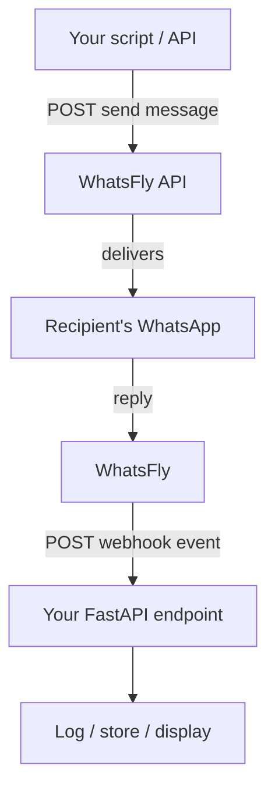

# WhatsFly Integration — Build Reference

Context document for building the WhatsFly send/receive pipeline. Companion file `whatsfly-integration-guide.html` (same content, styled) lives alongside this in the project folder for human reading — this `.md` is the version meant to be fed in as build context.

---

## ⚠️ Current build phase: single-message test — read this first

**We are not building marketing campaigns, broadcasts, or bulk sending yet.** This phase has one goal: prove the full send → receive round trip works, with one person, verified by eye.

**In scope right now:**
- Send **one** WhatsApp message to **one** sales rep's phone number, using a template that's **already approved** (do not build new template-creation logic yet).
- Stand up a minimal FastAPI webhook endpoint that receives WhatsFly's callbacks and logs them.
- Confirm, end to end: the rep receives the message → the rep replies → the reply shows up in the FastAPI logs.
- The rep will be sitting with the developer during the test to visually confirm receipt — no automated verification needed for this phase.

**Explicitly out of scope for now:**
- Bulk/multi-recipient sending, broadcasts, campaigns
- Customer segmentation, labels, custom-field pipelines
- New template creation/submission logic
- Catalog, orders, sequences
- Any Streamlit UI for this — the Streamlit app referenced elsewhere is a separate existing project; this phase is pure backend plumbing (a script + a FastAPI endpoint)

### Suggested build order for this phase

1. Confirm the `phone_number_id` for the connected WhatsApp Business number (from the WhatsFly dashboard).
2. Confirm at least one **already-approved** template exists and note its exact send request shape (pull a real example from the dashboard's template picker — see note under [Send template message](#send-template-message)).
3. *Alternative shortcut:* have the rep message the business number first — that opens a 24-hour session window, letting the test use plain `Send Text` instead of a template. Simpler for a first test, since there are no variables to fill.
4. Write a small script that sends the one test message (template or text) to the rep's number.
5. Write a minimal FastAPI route, e.g. `POST /webhook/whatsapp`, that logs the raw request body and returns `200 OK`.
6. Expose that route publicly (e.g. `ngrok` for local dev) and register the URL as the webhook in the WhatsFly dashboard.
7. Send the message. Have the rep reply.
8. Confirm the reply appears in the FastAPI logs. That's the round trip — done.

Only after this works should later phases (templated variables at scale, multi-recipient sends, segmentation) get built. Everything below this point is reference material for the *eventual* full system — useful for context, not a build spec for right now.

---

## Overview

WhatsFly is a WhatsApp Business Solution Provider — it sits on top of Meta's official WhatsApp Cloud API and adds messaging, contact management, and campaign tools behind one HTTP API. Long-term, it's the delivery layer between Streamlit's analysis (who's interested in what, what stock needs to move) and an actual WhatsApp message. Right now, it's just the plumbing for one message to one rep.

Two eventual use cases (future phases, not this one):
- **Customer offers** — interest scores and excess-stock lists turned into personalized, priced WhatsApp messages via approved templates.
- **Rep coordination** — product focus lists pushed to reps' WhatsApp, with customer replies routed to the right rep.

---

## How the pieces fit together

Sending and receiving are two separate, opposite-direction flows:
- **Send:** your code initiates a POST to WhatsFly. WhatsFly's response is just an acknowledgment (message accepted, here's an ID) — not a new incoming message.
- **Receive:** WhatsFly initiates a POST to *your* FastAPI webhook URL, whenever a reply, delivery/read status change, or button tap happens. This can't be Streamlit — it needs a small always-on service that accepts inbound HTTP calls.

---

## Core concepts

**Authentication** — every call carries `apiToken`, a single key from your WhatsFly dashboard tied to your whole account. Treat it like a password.

**`phone_number_id`** — identifies which connected WhatsApp Business number a call applies to. A constant for a single-number setup.

**Session messages vs. template messages** — the most important rule in the whole system:

| Type | When you can send it | Endpoints |
|---|---|---|
| Session (text/file/buttons) | Only within 24 hours of the recipient's last message to you | `send`, `send/file`, `send/interactive-buttons` |
| Template | Any time — this is how you reach someone who hasn't just messaged you | generated per-template in the dashboard |

Cold outbound (reaching someone who hasn't messaged recently) **must** go out as a template.

**GET vs POST** — most WhatsFly endpoints accept either. They're two ways to send the *same* request (query string vs. request body) — not related to sending vs. receiving. Prefer POST: GET puts `apiToken` in the URL, where it can leak into logs.

**Response envelope inconsistency** — most endpoints return `"status":"1"`/`"0"` as a **string**. Catalog endpoints return `"status":true`/`false` as a **boolean**. Handle both.

---

## Creating & approving templates

Not covered by a documented "create" API call — this happens in the WhatsFly dashboard UI, then gets used programmatically once approved.

1. Open the template builder in the dashboard.
2. Choose a category: Marketing (promotions/offers), Utility (order/account updates), or Authentication (OTPs).
3. Write the body with `{{1}}`, `{{2}}` variable placeholders, plus optional header/footer.
4. Submit for Meta review — minutes to 48 hours. Marketing templates face more scrutiny; avoid vague ad-like phrasing.
5. Check status via the `Get Template` API endpoint (`status`: Approved / Rejected / Pending) before using it in a send.

For **this phase**, use a template that's already approved — no new template work needed.

---

## API reference

**Base URL:** `https://app.whatsfly.net/api/v1` — every path below is relative to this.

### Messaging & media

**Send text message** — `POST /whatsapp/send`
Session message only (24h window).
Params: `apiToken`, `phone_number_id`, `phone_number`, `message` — all required.

**Send template message** — endpoint generated per-template from the dashboard picker, not a fixed documented path.
> Pull a real example from your dashboard before coding against it — this is the main endpoint for the eventual campaign phase, so worth confirming precisely, but not urgent for this phase if using the plain text-message shortcut.

**Send interactive buttons** — `POST /whatsapp/send/interactive-buttons`
Session message with 1–3 reply buttons (≤20 chars each), optional media header.
Params: `apiToken`, `phone_number_id`, `phone_number`, `message` (required); `buttons` (required, JSON array of `{id, title}`); `button_header_text`, `button_footer_text`, `media_url`, `media_id`, `media_type` (optional/conditional).

**Send file/media** — `POST /whatsapp/send/file`
Params: `apiToken`, `phone_number_id`, `phone_number` (required); `media_url` or `media_id` (one required); `media_type` (conditional); `media_name` (required if document); `media_caption_text` (optional).

**Upload media** — `POST /whatsapp/upload/media` (multipart)
Params: `apiToken`, `phone_number_id` (required); `media_file` (required, field name must be exactly `media_file`).

### Conversations & status

**Get conversation** — `GET/POST /whatsapp/get/conversation`
Params: `apiToken`, `phone_number_id`, `phone_number`, `limit` (≤50, required); `offset` (optional).

**Delivery/read status** — `GET/POST /whatsapp/get/message-status`
Params: `apiToken`, `wa_message_id`, `whatsapp_bot_id` — all required. For real-time tracking at scale, prefer the webhook over polling this.

**Post-back list** — `GET/POST /whatsapp/get/post-back-list`
Params: `apiToken`, `phone_number_id`.

### Templates & bot flows

**Get template(s)** — `GET/POST /whatsapp/get/template/list`
Params: `apiToken`, `phone_number_id`. Returns approval `status` per template.

**Bot flow list** — `GET/POST /whatsapp/get/bot-flow-list`
Params: `apiToken`, `phone_number_id`.

**Trigger bot flow** — `GET/POST /whatsapp/trigger-bot`
Params: `apiToken`, `phone_number_id`, `phone_number`, `bot_flow_unique_id` — all required.

### Subscribers & contacts

**Create subscriber** — `POST /whatsapp/subscriber/create`
Params: `apiToken`, `phoneNumberID`, `name`, `phoneNumber` — all required.

**Update subscriber** — `POST /whatsapp/subscriber/update`
Params: `apiToken`, `phone_number_id`, `phone_number` (required); `first_name`, `last_name`, `gender`, `label_ids` (optional).

**Get subscriber** — `GET/POST /whatsapp/subscriber/get`
Params: `apiToken`, `phone_number_id`, `phone_number` — all required.

**List subscribers** — `GET/POST /whatsapp/subscriber/list`
Params: `apiToken`, `phone_number_id`, `limit` (≤100, required); `offset`, `orderBy` (optional; `orderBy=1` sorts by most recent message).

**Assign custom fields** — `POST /whatsapp/subscriber/chat/assign-custom-fields`
Params: `apiToken`, `phone_number_id`, `phone_number`, `custom_fields` (JSON object) — all required. *(Main hook for future Streamlit output — not used in this phase.)*

**List custom fields** — `POST /whatsapp/subscriber/custom-fields/list`
Params: `apiToken`. Field definitions must exist first — likely created once via dashboard (no documented "create field" call).

**Delete subscriber** — `GET/POST /whatsapp/subscriber/delete`
Params: `apiToken`, `phone_number_id`, `phone_number` — all required.

**Reset input flow** — `POST /whatsapp/subscriber/reset/user-input-flow`
Params: `apiToken`, `phone_number_id`, `phone_number` — all required.

**Assign chat to team member** — `POST /whatsapp/subscriber/chat/assign-to-team-member`
Params: `apiToken`, `phone_number_id`, `phone_number`, `team_member_id` — all required.

**Mark conversation status** — `POST /whatsapp/subscriber/chat/mark-conversation`
Params: `apiToken`, `phone_number_id`, `phone_number`, `action` (one of `resolved`, `reopen`, `archived`, `unarchived`, `blocked`, `unblocked`) — all required.

**Add note** — `POST /whatsapp/subscriber/chat/add-notes`
Params: `apiToken`, `phone_number_id`, `phone_number`, `note_text` — all required.

### Labels & sequences

**Labels** — `GET/POST /label/create`, `GET/POST /label/list`
Params: `apiToken` (required for both); `label_name` (required for create).

**Assign/remove labels** — `POST /whatsapp/subscriber/chat/assign-labels`, `.../remove-labels`
Params: `apiToken`, `phone_number_id`, `phone_number`, `label_ids` (comma-separated) — all required.

**Sequence list** — `GET/POST /whatsapp/subscriber/sequence/list`
Params: `apiToken`, `phone_number_id`.

**Assign/remove sequence** — `POST /whatsapp/subscriber/chat/assign-sequence`, `.../remove-sequence`
Params: `apiToken`, `phone_number_id`, `phone_number`, `sequence_ids` (comma-separated) — all required.

### Catalog & orders *(not needed for this phase)*

**List catalogs** — `GET/POST /whatsapp/catalog/list` — `apiToken` required.
**Sync catalog** — `POST /whatsapp/catalog/sync` — `apiToken`, `whatsapp_catalog_id` required.
**List catalog orders** — `GET/POST /whatsapp/catalog/order/list` — `apiToken` required; `whatsapp_catalog_id` optional.
**Change order status** — `GET/POST /whatsapp/catalog/order/status-change` — `apiToken`, `order_unique_id`, `cart_status` (Approved/Completed/Shipped/Delivered/Refunded) required.

### Account & team

**Connect WhatsApp Business account** — `POST /whatsapp/account/connect`
Params: `apiToken`, `user_id`, `whatsapp_business_account_id`, `access_token` — all required. One-time setup, likely already done.

**Team members & roles** — `GET/POST /users/team-member/list`, `GET/POST /user/package/list`
Params: `apiToken`. Useful for mapping `team_member_id` for the rep-coordination phase.

**Direct login URL** *(likely not needed)* — `GET/POST /user/get/direct-login-url`
Looks built for agencies reselling WhatsFly under their own brand, not a single business's own account. Skip unless managing multiple client accounts.

---

## Webhooks

A webhook is WhatsFly calling *you*: a POST to a URL you register, fired when a reply arrives, a message's status changes, or a template button gets tapped.

- Register the URL in the WhatsFly dashboard's webhook/integration settings.
- Must be a separate always-on service (FastAPI/Flask) — Streamlit can't host an inbound endpoint.
- Respond `200 OK` promptly so WhatsFly knows it was received; slow or missing acknowledgment can trigger retries.
- For this phase: the endpoint just needs to log the raw payload — no processing logic yet.

---

## Gotchas & security

- **Use POST, not GET**, wherever both are offered — GET exposes `apiToken` in the URL/logs.
- **Store the token outside code** — environment variable or secrets manager, never hard-coded or committed.
- **Phone numbers** — country code + digits only, no `+`, no spaces.
- **Response envelopes** aren't fully consistent — string vs. boolean `status`. Handle both.
- **Message credits** are capped per plan tier — irrelevant for a single test message, matters once campaigns start.
- **The 24-hour rule** is what will silently break a cold-outbound send — use a template, or have the recipient message first (as in this phase's shortcut).

---

## Future reference: campaign use cases (not in scope yet)

Kept here for context on where this is eventually headed — not to be built in this phase.

**A. Excess-stock / product-interest offer campaign** — score customers in Streamlit → ensure subscriber exists → attach analysis via custom fields → label the batch → send approved template per customer → track outcomes via webhook.

**B. Sales rep coordination** — rank product priorities per rep in Streamlit → send briefing via text/template → route customer replies to the right rep via `assign-to-team-member` → keep shared context via `add-notes`.
